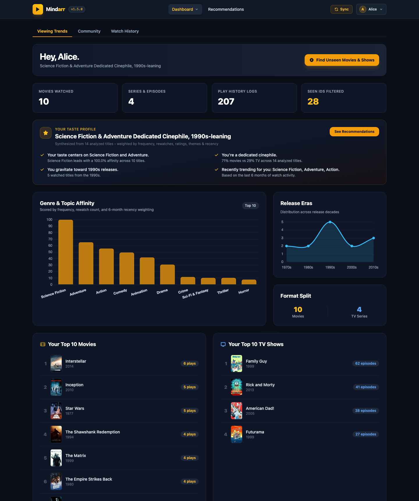
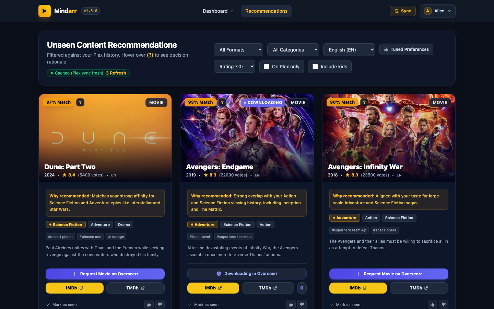
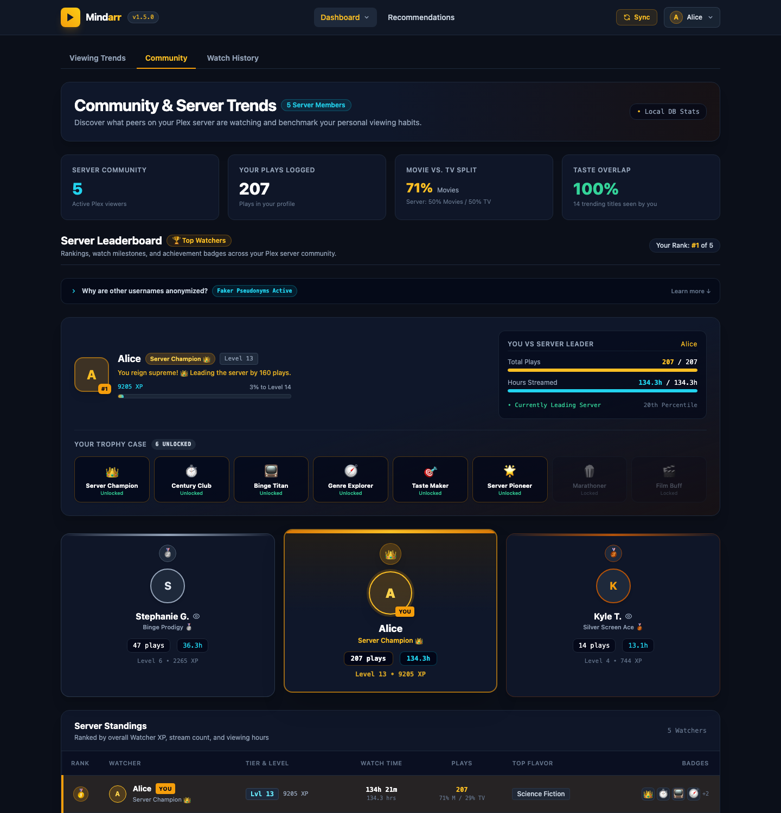

# Mindarr — Watch History Analyzer & Discovery Engine

A containerized analytics engine and recommendation dashboard that analyzes each user's
Plex watch history (enriched via Tautulli), identifies their genre and creator affinities,
queries TMDb for top-rated movies and TV shows they have **never watched before**, and
**1-click requests them via Overseerr**.

Deployable as a **TrueNAS SCALE Custom App** or standalone Docker container. Web-only.

---

## Preview

### Viewing Trends & Taste Profile
Time-decayed genre affinity, release-decade distribution, and your top 10 movies & TV shows — all backed by cited metrics in a narrative taste-profile summary.



### Unseen Recommendations
TMDb-powered discovery cards with match scores, decision rationale tooltips, and 1-click Overseerr requests — filtered against your watch history for guaranteed-unseen picks.



### Community & Server Leaderboard
Server-wide benchmarks, RPG-style watcher levels/XP, achievement badges, and a podium leaderboard — with peer identities anonymized for privacy.



---

## Features

- **Sign in with Plex**: Browser-based OAuth PIN login. The **first user to sign in becomes
  the Administrator/owner**; additional users are authorized if they are the server owner or
  a shared user of the configured Plex server.
- **Multi-user, per-account recommendations**: Watch data, taste profile, seen-index, and
  recommendations are scoped to the logged-in user.
- **Tautulli enrichment (optional)**: When configured, per-user watch history is pulled from
  Tautulli. If Tautulli is not configured — or a user has no Tautulli history — that user
  simply has no recommendations (nothing is pulled).
- **Viewing Trends & Taste Profiling**: Time-decayed genre affinity, rewatch/rating boosts,
  top directors and cast, and release-decade distribution.
- **TMDb Discovery Engine** with **strict unseen deduplication** against cached IMDb, TMDb,
  TVDb IDs and normalized titles.
- **Overseerr Integration**: 1-click request button on each recommendation card.
- **Modern Web Dashboard**: Responsive dark-mode UI with Chart.js charts, plus a background
  sync scheduler.
- **Installable PWA**: Add Mindarr to your home screen or desktop for an app-like experience,
  with offline fallback and a network-first service worker.
- **Sessions**: 1-hour session lifetime; the Plex token is validated at login.

---

## TrueNAS SCALE Deployment

1. On TrueNAS SCALE: **Apps** → **Discover Apps** → **Install Custom App**.
2. Set an **Application Name** (e.g. `mindarr`).
3. Paste the following Compose YAML:

```yaml
services:
  mindarr:
    container_name: mindarr
    image: ghcr.io/drizzlyowl/mindarr:latest
    restart: unless-stopped
    ports:
      - "8080:8080"
    environment:
      - TZ=Europe/London
      - CONFIG_DIR=/config
      - PORT=8080
      - HOST=0.0.0.0
      - AUTO_SYNC_HOURS=24
      # Optional: pre-fill instead of using the Settings UI wizard.
      # Values set here are "locked" (read-only) in Settings.
      # - PLEX_URL=https://10.255.10.30:32400
      # - PLEX_TOKEN=
      # - TMDB_API_KEY=
      # - OVERSEERR_URL=http://10.255.10.30:5055
      # - OVERSEERR_API_KEY=
      # - TAUTULLI_URL=
      # - TAUTULLI_API_KEY=
    volumes:
      # TrueNAS SCALE: point this at your dataset, e.g. /mnt/tank/appdata/mindarr
      - /mnt/tank/appdata/mindarr:/config
      # Cached TMDb posters (persisted across upgrades; safe to delete to reclaim disk)
      - /mnt/tank/appdata/mindarr/posters:/app/plex_recommender/web/static/posters
```
*(Replace the storage paths with your dataset.)*

4. Click **Install**, then open `http://<truenas-ip>:8080`.
5. Sign in with Plex — the first account to sign in becomes the Administrator and is
   walked through a first-run setup wizard (Plex → TMDb → optional Overseerr/Tautulli →
   initial sync).

> No env vars are strictly required at deploy time: everything above can instead be
> configured from the web UI after first login. Only pre-fill environment variables if you
> want them locked and managed outside the Settings page (e.g. via a secrets manager).

---

## Running (Docker / local)

A ready-to-use `docker-compose.yml` is included in this repo (builds the image locally
from the `Dockerfile` and mounts `./config` for persistent data + `./config/posters` for
the poster cache). All environment variables in it have sane defaults, so you can run it
as-is and configure Plex/TMDb/Overseerr/Tautulli from the Settings UI after first login —
or export overrides (e.g. `PLEX_URL`, `TMDB_API_KEY`) before running to pre-fill them:

```bash
# Docker (build from source)
docker compose up -d --build

# Pull the published image instead of building locally
docker run -d --name mindarr -p 8080:8080 \
  -v ./config:/config \
  -v ./config/posters:/app/plex_recommender/web/static/posters \
  ghcr.io/drizzlyowl/mindarr:latest

# Local (no Docker)
uvicorn plex_recommender.web.app:app --host 0.0.0.0 --port 8080
# or
python -m plex_recommender
```

---

## Web Dashboard Usage

1. Open `http://localhost:8080` and **Sign in with Plex**. The first account becomes the
   Administrator.
2. As the Administrator, open **Settings & Sync**:
   - Enter your free **TMDb API Key** ([themoviedb.org/settings/api](https://www.themoviedb.org/settings/api)).
   - (Optional) Enter your **Overseerr** URL + API Key for 1-click requests.
   - (Optional) Enter your **Tautulli** URL + API Key to enable per-user watch history.
   - Click **Sync Now**.
3. Other authorized users can now sign in and see recommendations tailored to their own
   Tautulli history.
4. Visit **Dashboard & Trends** and **Unseen Recommendations**.

---

## Installing as an App (PWA)

Mindarr is an installable Progressive Web App:

- **Desktop (Chrome/Edge)**: click the install icon in the address bar, or use the
  **Install App** option in the user menu.
- **Android (Chrome)**: use the **Install App** option in the user menu, or the browser's
  "Add to Home screen" prompt.
- **iOS (Safari)**: tap **Share** → **Add to Home Screen**.

Once installed, Mindarr launches in its own standalone window/icon, and a lightweight
service worker keeps the app responsive and shows an offline page if your connection drops.
Caching is **network-first** — the app always prefers fresh data and only falls back to
cached content when offline.

---

## Caching & Sync Freshness

- Recommendations are cached in SQLite keyed by `user_key` + filters
  (`media_type:genre:language:min_rating:limit`).
- Cache entries store the `last_sync_time` version and are cleared whenever a sync completes,
  so newly watched titles and updated taste scores take effect immediately.
- Force a fresh query via the **↻ Refresh** link in the header.
